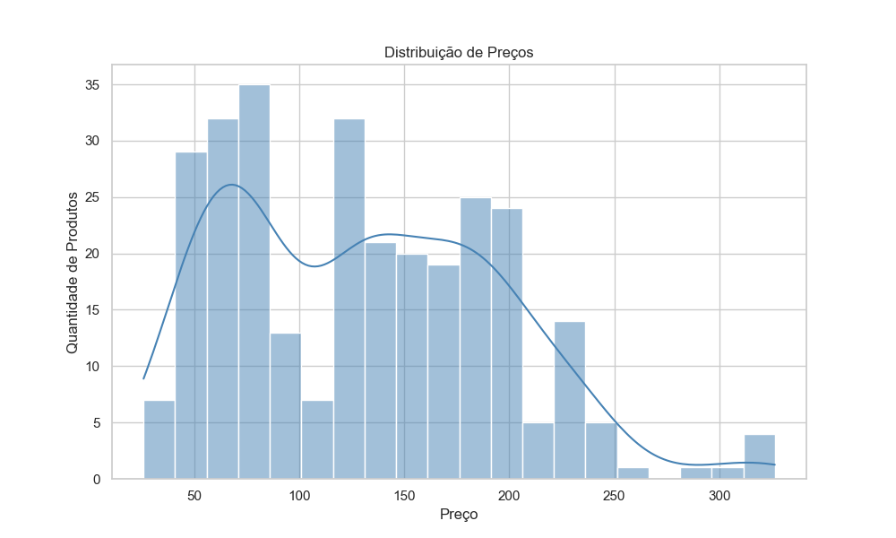
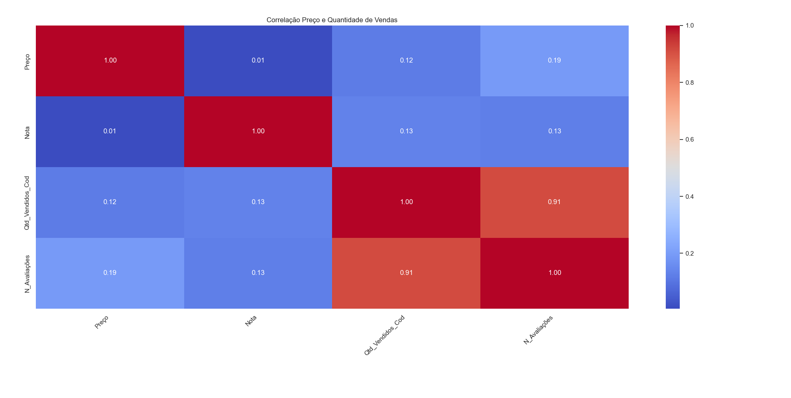

# 📊 Análise de Dados de E-commerce

## 📌 Visão Geral
Este projeto realiza uma análise exploratória de dados (EDA) utilizando um dataset de produtos de e-commerce.

O objetivo é explorar características dos produtos e identificar possíveis relações entre preço, avaliações, vendas e atributos dos produtos, como marca e temporada.

## 🛠 Tecnologias utilizadas

- Python
- Pandas
- Matplotlib
- Seaborn

## 🧱 Estrutura do Projeto

analise-ecommerce-python
│
├── BD
│   └── ecommerce_estatistica.csv
│
├── Imagens
│   ├── histograma_precos.png
│   ├── heatmap_correlacao.png
│   └── regressao_vendas.png
│
├── graficos.py
└── README.md

## 📁 Dataset

O dataset contém informações sobre produtos de e-commerce, incluindo variáveis como:

- Título do produto
- Preço
- Nota média
- Número de avaliações
- Desconto
- Marca
- Temporada
- Quantidade de vendas

Essas variáveis permitem investigar possíveis padrões relacionados à popularidade dos produtos, comportamento de preços e feedback dos clientes.

## 📊 Análises realizadas

Foram geradas diferentes visualizações para explorar o comportamento dos dados:

1. **Distribuição de preços (Histograma)**  
   Permite visualizar como os preços dos produtos estão distribuídos no dataset.

2. **Relação entre preço e avaliação (Gráfico de dispersão)**  
   Analisa se produtos mais caros tendem a receber melhores avaliações.

3. **Correlação entre variáveis numéricas (Mapa de calor)**  
   Mostra relações entre variáveis como:
- preço
- avaliações
- número de reviews
- quantidade vendida

4. **Marcas mais frequentes (Gráfico de barras)**  
   Identifica quais marcas aparecem com maior frequência no catálogo.

5. **Distribuição de produtos por temporada (Gráfico de pizza)**  
   Mostra como os produtos se distribuem entre diferentes temporadas.

6. **Concentração de preços (Gráfico de densidade)**  
   Exibe onde os preços se concentram no dataset.

7. **Relação entre vendas e avaliações (Gráfico de regressão)**  
   Investiga se produtos com maior volume de vendas apresentam melhores avaliações.

## 📷 Gráficos

## 🔎 Principais insights

Some insights obtained from the analysis:

- A maior parte dos produtos possui preços entre 50 e 200, indicando concentração em uma faixa intermediária de preço.
- Não foi identificada forte correlação entre preço e avaliação, sugerindo que produtos mais caros não necessariamente recebem melhores notas.
- Produtos com maior quantidade de vendas tendem a apresentar avaliações ligeiramente melhores, o que pode indicar que produtos populares geram maior satisfação dos consumidores.
- Algumas marcas aparecem com maior frequência no catálogo, indicando possível concentração de produtos em determinadas marcas.
- O catálogo apresenta maior presença de produtos associados às temporadas Primavera/Verão, sugerindo foco em produtos voltados para climas mais quentes.

## ▶ Como executar o projeto

1. Clone o repositório
git clone https://github.com/eduardo-hribeiro/analise-ecommerce-python.git

2. Instale as bibliotecas necessárias
pip install pandas matplotlib seaborn

3. Execute o script de análise
python graficos.py

👨‍💻 Autor

Eduardo Ribeiro

Projeto desenvolvido como parte dos estudos em Análise de Dados com Python.
