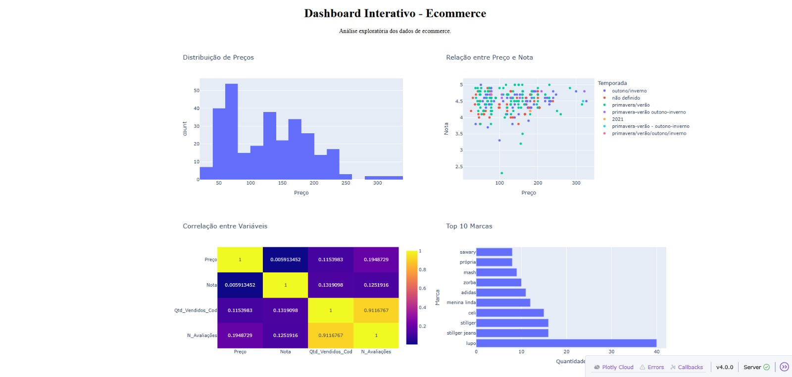
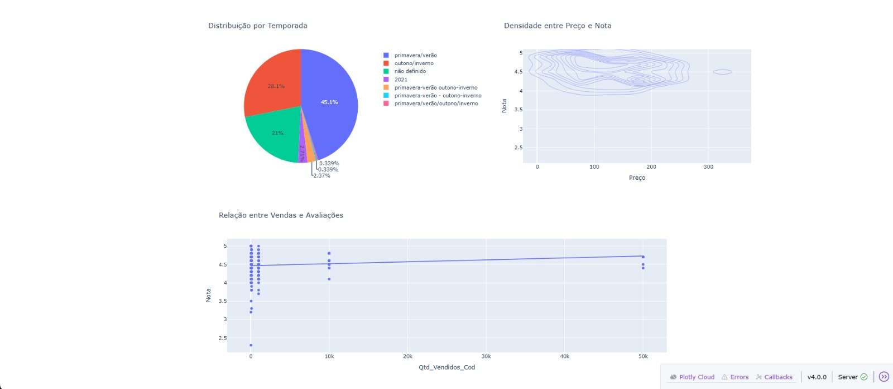

# 📊 Análise de Dados de E-commerce
Este projeto realiza uma análise exploratória de dados (EDA) utilizando Python para investigar padrões em um dataset de produtos de e-commerce.

A análise busca identificar relações entre preço, avaliações, vendas e atributos dos produtos, utilizando visualizações para facilitar a interpretação dos dados.

## 📌 Objetivo do projeto
Explorar um dataset de e-commerce para identificar padrões que possam ajudar a entender:
 - distribuição de preços dos produtos
 - relação entre preço e avaliações
 - possíveis fatores relacionados ao volume de vendas
 - presença de marcas no catálogo

## 🛠 Tecnologias utilizadas

- Python
- Pandas
- Matplotlib
- Seaborn
- Plotly
- Dash

## 🧱 Estrutura do Projeto

```
analise-ecommerce-python
│
├── ecommerce_estatistica.csv
├── graficos_matplotlib.py
├── app_dash.py
├── images (Dashboard)
├── requirements.txt
└── README.md
```

## 📁 Dataset

O dataset contém informações sobre produtos de e-commerce, incluindo variáveis como:

- Título do produto
- Preço
- Nota média
- Número de avaliações
- Desconto
- Marca
- Temporada
- Quantidade de vendas

Essas variáveis permitem investigar possíveis padrões relacionados à popularidade dos produtos, comportamento de preços e feedback dos clientes.

## 📊 Dashboard Interativo (Dash)

Além da análise exploratória, foi criada uma aplicação interativa utilizando **Dash e Plotly** para visualização dos dados.

O dashboard inclui:
- Distribuição de preços (Histograma)
- Relação entre preço e avaliação (Scatter Plot)
- Correlação entre variáveis (Heatmap)
- Top marcas de produtos
- Distribuição por temporada (Pizza)
- Densidade entre preço e avaliação
- Relação entre vendas e avaliações (Regressão)





## 🔎 Principais insights

A análise exploratória revelou alguns padrões interessantes:

- A maior parte dos produtos possui preços entre 50 e 200, indicando concentração em uma faixa intermediária de preço.
- Não foi identificada forte correlação entre preço e avaliação, sugerindo que produtos mais caros não necessariamente recebem melhores notas.
- Produtos com maior quantidade de vendas tendem a apresentar avaliações ligeiramente melhores, o que pode indicar que produtos populares geram maior satisfação dos consumidores.
- Algumas marcas aparecem com maior frequência no catálogo, indicando possível concentração de produtos em determinadas marcas.
- O catálogo apresenta maior presença de produtos associados às temporadas Primavera/Verão, sugerindo foco em produtos voltados para climas mais quentes.

## ▶ Como executar o projeto

1. Clone o repositório
   - git clone https://github.com/eduardo-hribeiro/analise-ecommerce-python.git

2. Instale as bibliotecas necessárias
   - pip install pandas matplotlib seaborn dash plotly statsmodels

3. Execute o script de análise
   - python graficos_matplotlib.py
   - python app_dash.py

## 👨‍💻 Autor

Eduardo Ribeiro

Projeto desenvolvido como parte dos estudos em Análise de Dados com Python.
